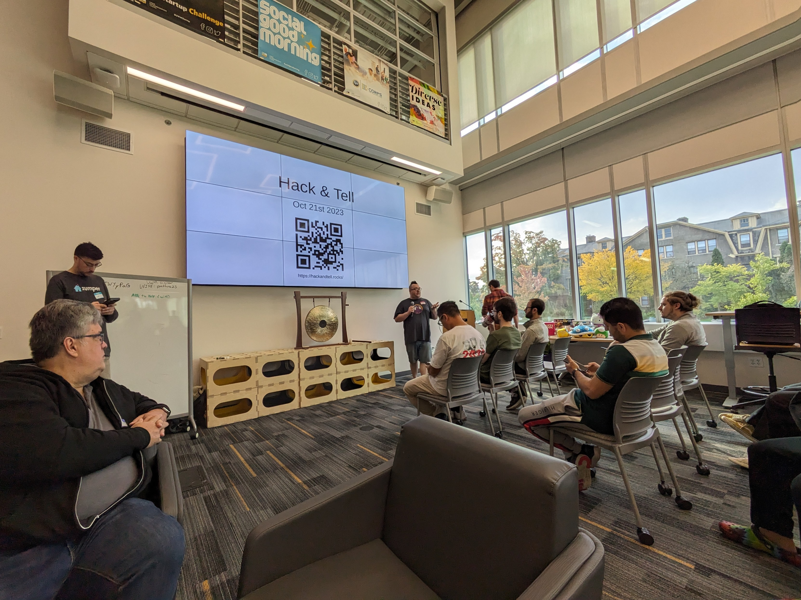

We are pleased to announce that the 26th Hack and Tell will be November 2nd
2024!

Thank you everyone for your support as we are getting these events going
again! However we do not currently have any sponsors for this event so we are
***not*** going to be able to provide lunch. I know this is a bummer, but this
event is in the 3rd Ward so there are lots of lunch options available.

Also, we ask that everyone please make sure you RSVP if you are planning on
coming. Like wise, if you've RSVP'd and aren't going to make it please make
sure to cancel your RSVP as we generally have limited space and would hate to
turn anyone away.

# About

Hack and Tell is 8 hours of creative and collaborative production. No business
models. No customer validation. No pitches. **Just a time to hang out and
create something awesome.**

Build something for yourself, your friends, or help someone else build
something. It can be useful or completely useless. In short, **build whatever
you want**. At the end of the event, you'll get the chance to stand up and show
us what you built or not. And if you do present you can pick a fun prize as
well!

# RSVP

RSVP's are not yet open, please check back later.

# Location

[Form Labs  
220 E Buffalo Street  
Milwaukee, WI 53202](https://www.openstreetmap.org/node/5560576658#map=19/43.03407/-87.90831)

# Sponsors

None yet, if you're interested, please get in [touch](/contact)!

# Schedule

**9:00 AM - 9:30 AM | Doors Open - Coffee**

Grab a coffee, and find a good spot to set up shop for the day.

**9:30 AM - 10:00 AM | Project Introductions**

Short introduction about who you are, and what you plan to work on.

**10:00 AM - 12:00 PM | Work Time**

Work on your project. Feel free to walk around and chat with others to see
what they are working on.

**12:00 PM - 1:00 PM | Lunch**

Lunch will **not** be provided. We may order some pizzas if enough people are
interested. Feel free to leave to grab food elsewhere. No set end time for
lunch. Be sure to take a break though, this is a great time to see what others
are working on.

**12:00 PM - 3:30 PM | Work Time**

Work on your project. Feel free to walk around and chat with others to see
what they are working on.

**3:30 PM - 4:30 PM | Project Presentations & Raffle**

Give a short presentation on the progress you made during the day. This is
optional, but if you do present, you will be entered into a drawing for some
fun prizes.

